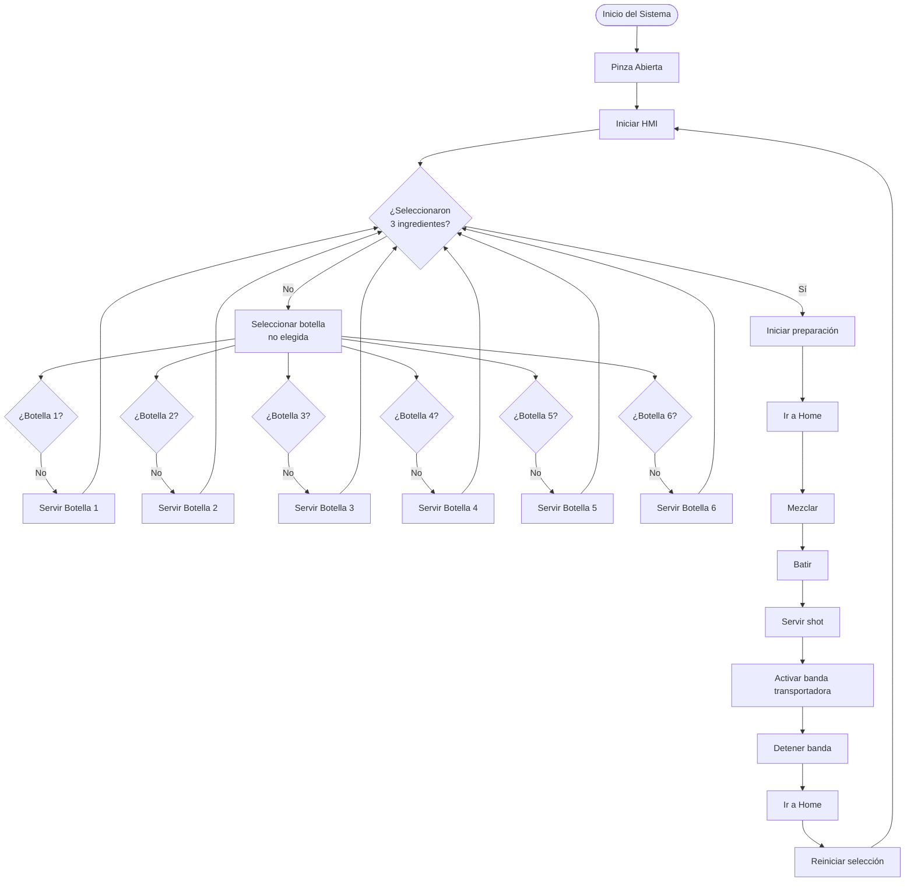

# Proyecto Final - Robótica Industrial Automatización del Proceso de "Bartender".
## Integrantes
- Juan Esteban Otavo García
- Ian Saonni Rodríguez Pulido
- David Felipe Garcia Lopez
- Nicolas Fernado Davila Peñuela
## Introducción
La robótica industrial se ha consolidado como una herramienta fundamental para la automatización de procesos que demandan altos niveles de precisión, repetibilidad y seguridad. En particular, la implementación de sistemas robotizados en tareas tradicionalmente manuales permite mejorar la eficiencia operativa, reducir riesgos asociados a la intervención humana y garantizar una calidad constante en el producto final. En este contexto, la automatización de procesos de preparación de bebidas representa un caso de estudio relevante para la integración de manipuladores industriales, sistemas de control y herramientas especializadas.
El presente repositorio documenta el desarrollo e implementación de un sistema automatizado tipo bartender utilizando el robot industrial ABB IRB140 "Abel", asignado para la ejecución del proyecto. A lo largo del desarrollo de este,se abordaron aspectos clave como el diseño de un gripper multipropósito accionado neumáticamente, la organización del espacio de trabajo, la definición de trayectorias seguras y eficientes para el robot Abel, y la comparación entre el tiempo de alistamiento manual y el proceso automatizado. De esta manera, el proyecto no solo permite aplicar los conceptos vistos en el curso de Robótica Industrial, sino que también evidencia el potencial de los sistemas robotizados en aplicaciones reales de automatización flexible dentro de entornos industriales y de laboratorio.
## Descripción de la Solución
El desarrollo de la solución se abordó como un sistema robótico secuencial y modular orientado a la automatización del proceso de preparación de bebidas, integrando selección de ingredientes, mezcla, batido y servido final. Desde la etapa de alistamiento, se definieron las posiciones cartesianas del entorno de trabajo del robot ABB , incluyendo estaciones de botellas en dos niveles, jigger, coctelera, cuchara de mezcla, tapa, banda transportadora y zona de Home. Estas posiciones fueron calibradas y almacenadas como constantes robtarget, garantizando repetibilidad y precisión en cada ciclo de operación.

Como herramienta principal se utilizó el lenguaje RAPID en RobotStudio, aprovechando su estructura modular para dividir el proceso en subrutinas funcionales independientes. Cada rutina (Path_BotellaX, Path_Verter, Path_Mezclar, Path_Batir, Path_Servir_shot, entre otras) representa una acción física concreta del robot, lo que facilitó tanto la depuración del código como la comprensión del flujo general del sistema. La pinza del robot fue configurada mediante señales digitales, donde el control de apertura y cierre se realizó a través de la salida DO_04, sincronizando los movimientos con tiempos de espera (WaitTime) para asegurar una correcta manipulación de botellas, utensilios y recipientes.

El proceso inicia con el robot en una posición segura de Home y con la pinza abierta, asegurando condiciones iniciales controladas. A partir de una interfaz HMI, el usuario selecciona los ingredientes deseados, los cuales son gestionados mediante variables persistentes booleanas que permiten identificar tanto la selección actual como si una botella ya fue utilizada previamente. Esta lógica evita duplicaciones y limita el proceso a un máximo de tres ingredientes por bebida, condición verificada continuamente dentro de un bucle infinito en el procedimiento principal (main). Cada selección válida activa la rutina correspondiente, en la cual el robot se desplaza a la botella seleccionada, la toma, realiza el vertido controlado en el jigger y posteriormente transfiere el contenido a la coctelera.

Una vez completada la selección de los tres ingredientes y confirmada la finalización de la etapa de alistamiento, el sistema ejecuta de manera secuencial las rutinas de mezcla y batido. En la fase de mezcla, el robot toma la cuchara, la introduce en la coctelera y realiza trayectorias circulares mediante movimientos interpolados, simulando el mezclado manual. Posteriormente, en la fase de batido, el robot coloca la tapa, ejecuta movimientos repetitivos de inversión para simular el batido de la bebida y, finalmente, destapa la coctelera para servir el contenido en el shot mediante un movimiento controlado de giro.

El proceso concluye con la colocación del shot en la banda transportadora, la cual es activada por un tiempo definido para permitir la entrega del producto final. Una vez servida la bebida, el sistema realiza un reinicio completo de las variables de selección y estado, retornando el robot a la posición Home y dejando el sistema listo para iniciar un nuevo ciclo. Esta estrategia de reinicio garantiza un comportamiento cíclico, robusto y seguro, permitiendo la operación continua del sistema sin intervención manual adicional.
## Diagrama de Flujo

## Descripción del Gripper
## Modelo Robot Studio
La celda robótica fue desarrollada y validada en ABB RobotStudio, donde se modeló el entorno completo de trabajo del robot, incluyendo la disposición de las botellas, el jigger, la coctelera, los utensilios, la banda transportadora y la posición Home. En este entorno se definieron y calibraron los sistemas de coordenadas, herramientas y objetos de trabajo, permitiendo simular con precisión los movimientos del robot y verificar colisiones, alcances y secuencias antes de la ejecución real. El uso de RobotStudio facilitó la integración entre el programa en lenguaje RAPID y el modelo virtual de la celda, asegurando coherencia entre la lógica de control y el comportamiento físico del sistema.La simulación de la celda sera presentada acontinuacion en el video de comprobación

## Código Rappid
### Código de Rutina
Para realizar el codgio de cada una de las rutinas se usaron las siguientes funciones 
- MoveL – Movimiento lineal cartesiano, para realizar los movimientos que iban de los puntos de aproximacioón a los puntos de agarre de cada objeto 
- MoveC – Movimiento circular cartesiano, empleado para curvas en la trayectoria de mezclar al usar la cucharilla
- MoveJ – Movimiento articular, utilizado para cambios rápidos entre posiciones de aproximacion de los distintos objetos 
- SET activa una salida 
- RESET desactiva una salida.
### Código HMI
Revisar código rapid [ Programa RAPID - Module1.mod](./Module1.mod)
## Comparación del tiempo de Alistamiento Manual y Automatizado
## Video de Desmostración
